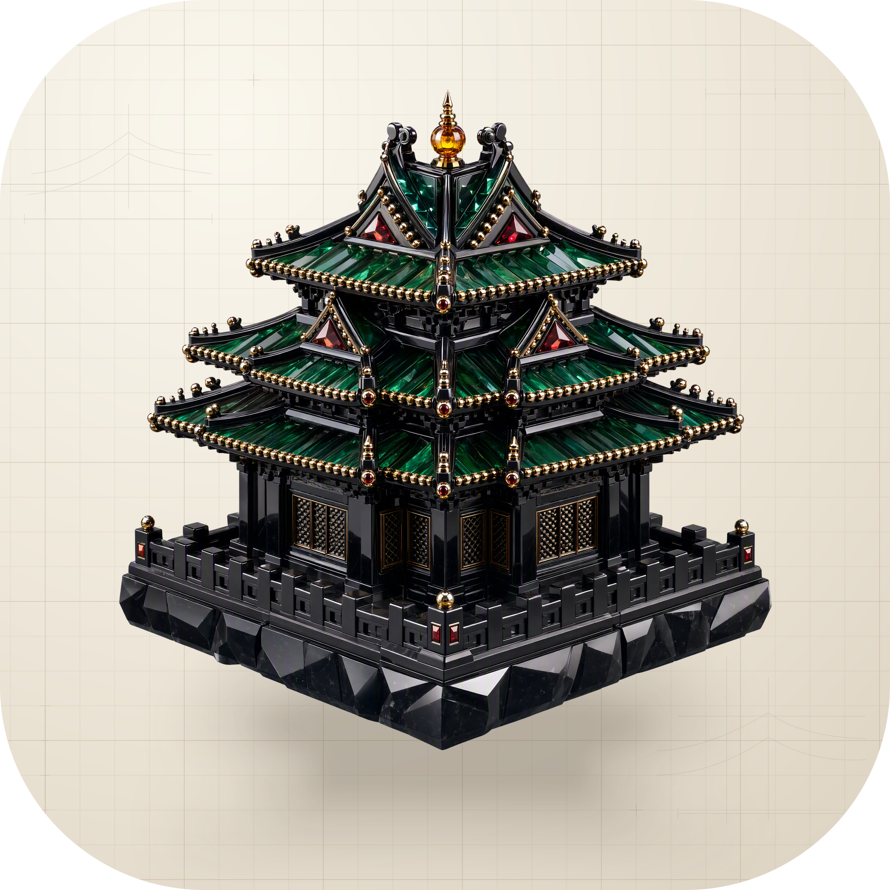

<p align="center">
  
</p>

<h1 align="center">Basalt</h1>

<p align="center">Consistent controls, cards, charts, and page layouts for React applications.</p>

<p align="center">
  <a href="https://basaltui.com">Website</a> ·
  <a href="../README.md">简体中文</a>
</p>

## What it does

Basalt contains the [@nocoo/basalt](https://www.npmjs.com/package/@nocoo/basalt) npm component library and a website showing its components, APIs, and application scenarios. Use it to give forms, navigation, data views, and page layouts a shared structure in React applications.

Matte surfaces and differences in luminance separate the page background, content areas, and cards. Health, finance, chat, and network pages in the showcase use demonstration data; the library does not provide a business backend or authentication service.

## Features

- React buttons, inputs, forms, overlays, tables, date selection, sidebars, notifications, and compound cards.
- Charts, statistic blocks, and page-layout examples, with separate import paths for larger controls and visualizations.
- Light and dark themes, accent colors, and custom palettes, with shared tokens for layered surfaces.
- Tailwind CSS v4 and precompiled standalone CSS styling options.
- A `/ui` catalog with interactive examples, prop documentation, and source views, plus complete application-layout, login, and resource-management examples.
- Guidance for Next.js client boundaries, theme initialization, and SSR integration.

## Usage

In an existing React 19 / React DOM 19 application, install the component library and its icon dependency:

```bash
bun add @nocoo/basalt lucide-react
```

<a id="css-setup"></a>

### Configure styles

For Tailwind CSS v4, import Basalt tokens and Tailwind in your main stylesheet. This `@source` path assumes the stylesheet lives in `src/`; adjust it for the actual location:

```css
@source "../node_modules/@nocoo/basalt/dist/**/*.{js,jsx,ts,tsx}";
@import "@nocoo/basalt/styles/tailwind";
@import "tailwindcss";

@layer base {
  html, body, #root {
    height: 100%;
  }
  body {
    @apply bg-basalt-background text-basalt-foreground antialiased;
  }
}
```

Applications without Tailwind can import the precompiled stylesheet from their entry module:

```ts
import "@nocoo/basalt/styles/standalone";
```

Standalone CSS includes tokens, control styles, and animations without a global reset. The application owns container height and its base layout.

<a id="component-usage"></a>

### Use components

```tsx compile:readme-quickstart
import { Button, Input, LayerCard, ThemeProvider } from "@nocoo/basalt";
import { DatePicker } from "@nocoo/basalt/components/date-picker";

export function App() {
  return (
    <ThemeProvider>
      <LayerCard>
        <LayerCard.Header>
          <span className="font-semibold text-basalt-foreground">Overview</span>
        </LayerCard.Header>
        <LayerCard.Body>
          <Input placeholder="Project Name" aria-label="Project Name" />
          <DatePicker aria-label="Target Date" />
          <Button variant="default">Submit</Button>
        </LayerCard.Body>
      </LayerCard>
    </ThemeProvider>
  );
}
```

The `@nocoo/basalt/charts/*` paths require Recharts 3. The current built-in DatePicker and DataTable implement their interactions internally and do not require the declared optional react-day-picker or TanStack Table peers; install those when integrating them directly. In Next.js, put interactive components inside a `"use client"` module.

See [INTEGRATION.md](../INTEGRATION.md) for themes, routing adapters, forms, and SSR, and [RECIPES.md](../packages/basalt/ai/RECIPES.md) for application layouts.

## Development

The repository uses Bun workspaces and pins Bun 1.4.0 in `packageManager`. Node.js 24 or newer is recommended.

```bash
git clone https://github.com/nocoo/basalt.git
cd basalt
bun install --frozen-lockfile
bun run dev
```

The showcase runs at `http://localhost:7003` and needs no backend account. Site code lives in `src/`, and public components in `packages/basalt/src/`. The development server imports workspace source directly.

```bash
bun run typecheck
bun run lint
bun run build
bun run preview
bun run --cwd packages/basalt build
```

Site output goes to the root `dist/`; library output goes to `packages/basalt/dist/`. The site is hosted as Cloudflare Workers static assets. `/api/live` exists only in the Vite development server. The root package is the private showcase; the npm library lives in `packages/basalt/`.

## Tests

| Layer / scenario | Run from the repository root |
| --- | --- |
| Unit and component tests | `bun run test` |
| Tailwind / standalone consumer integration | `bun run consumer:tailwind`, `bun run consumer:standalone` |
| Next.js SSR and browser interaction | `bun run consumer:next` |
| Charts and optional-peer integration | `bun run consumer:heavy` |
| Documentation code examples | `bun run consumer:docs` |
| Showcase browser tests | `bun run test:showcase` |

Run `bun run playwright:install` before browser tests. External-consumer tests pack, install dependencies, and build in temporary directories; they need npm and network access and manage their own test ports. Run `bun run --cwd packages/basalt build` before `consumer:docs`. Use `bun run test:coverage` for a unit-test report. See [fixtures/README.md](../fixtures/README.md) for fixture details.

## Stack


| Area | Implementation |
| --- | --- |
| Component library | React, TypeScript, Radix UI, ESM subpath exports |
| Styles and charts | CSS tokens, Tailwind CSS / standalone CSS, Recharts, Lucide |
| Showcase | Vite, React Router, i18next, Cloudflare Workers static assets |
| Development and tests | Bun, Biome, Vitest, Testing Library, Playwright, TypeScript consumer fixtures |

## Documentation

- [Application integration](../INTEGRATION.md)
- [Application-layout, login, and resource examples](../packages/basalt/ai/RECIPES.md)
- [Package usage](../packages/basalt/README.md)
- [Public API and compatibility](../packages/basalt/ai/COMPATIBILITY.md)
- [Component catalog](https://basaltui.com/ui)
- [Brand assets](../assets/brand/README.md)

## License

[MIT](../LICENSE) © 2026 Zheng Li
